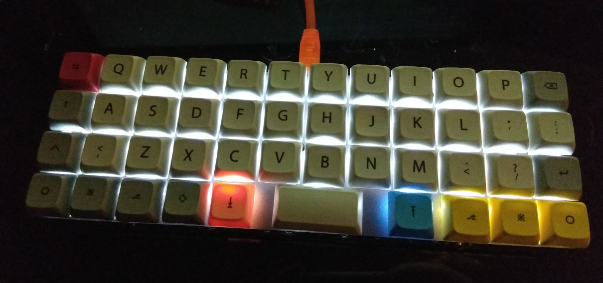

# mjturt keymap for AMJ40 ortholinear

Keymap is for planck-like ortholinear AMJ40 keyboard. It is intended to use with finnish software layout.

- Nordic layout kept in mind
- Designed for generic use and programming
- Vi-like
- Leader key stuff
- Backlighting and "caps lock led" reacting to layers

#### Build
```
make amj40:mjturt
```

## Leader key
- VM workspace
- IP
 
## Layers:
- Default (DEF)
- M1: Special characters (SPC)
- M2: Numbers (NUM)
- M3: Navigation (NAV)
- M4: Function keys (FUN)
- M5: Numpad (NUP)
- M6: Gaming (GAM)

FI-keymap translations on the right of diagram

### Default (DEF)
```
┌──────┬──────┬──────┬──────┬──────┬──────┬──────┬──────┬──────┬──────┬──────┬──────┐
│Tab/M5│   Q  │   W  │   E  │   R  │   T  │   Y  │   U  │   I  │   O  │   P  │  BS  │
├──────┼──────┼──────┼──────┼──────┼──────┼──────┼──────┼──────┼──────┼──────┼──────┤
│Esc/M3│   A  │   S  │   D  │   F  │   G  │   H  │   J  │   K  │   L  │   ;  │   '  │ ... K L Ö Ä
├──────┼──────┼──────┼──────┼──────┼──────┼──────┼──────┼──────┼──────┼──────┼──────┤
│ Shift│   Z  │   X  │   C  │   V  │   B  │   N  │   M  │   ,  │   .  │   /  │Ent/M3│ ... , . - Ent/M3
├──────┼──────┼──────┼──────┼──────┼──────┴──────┴──────┼──────┼──────┼──────┼──────┤
│ Ctrl │ GUI  │ LEAD │ Alt  │  M1  │        Space/M4    │  M2  │ AltGr│rAlt+2│ \/Sft│ ... M2 AltGr @ '/Shift
└──────┴──────┴──────┴──────┴──────┴────────────────────┴──────┴──────┴──────┴──────┘
```

### M1: Special characters (SPC)
```
┌──────┬──────┬──────┬──────┬──────┬──────┬──────┬──────┬──────┬──────┬──────┬──────┐
│  ~   │   !  │   @  │   #  │   $  │   %  │   ^  │   &  │   *  │   (  │   )  │      │ ½ ! " # ¤ % & / ( ) =
├──────┼──────┼──────┼──────┼──────┼──────┼──────┼──────┼──────┼──────┼──────┼──────┤
│      │   [  │      │      │      │rAlt+4│rAlt+]│   *  │   (  │rAlt+-│   }  │   |  │   å S D F $ ~ ( ) \ ^ *
├──────┼──────┼──────┼──────┼──────┼──────┼──────┼──────┼──────┼──────┼──────┼──────┤
│      │   +  │   =  │   ]  │      │      │      │rAlt+8│rAlt+9│   -  │   _  │      │   ` ´ ¨ V B N [ ] + ? 
├──────┼──────┼──────┼──────┼──────┼──────┴──────┴──────┼──────┼──────┼──────┼──────┤
│      │      │      │      │      │                    │      │      │      │      │
└──────┴──────┴──────┴──────┴──────┴────────────────────┴──────┴──────┴──────┴──────┘
```

### M2: Numbers (NUM)
```
┌──────┬──────┬──────┬──────┬──────┬──────┬──────┬──────┬──────┬──────┬──────┬──────┐
│  `   │   1  │   2  │   3  │   4  │   5  │   6  │   7  │   8  │   9  │   0  │      │ § 1 2
├──────┼──────┼──────┼──────┼──────┼──────┼──────┼──────┼──────┼──────┼──────┼──────┤
│      │      │      │      │      │      │      │      │      │      │      │      │
├──────┼──────┼──────┼──────┼──────┼──────┼──────┼──────┼──────┼──────┼──────┼──────┤
│      │rA+nub│      │      │      │      │      │      │      │      │      │      │ |
├──────┼──────┼──────┼──────┼──────┼──────┴──────┴──────┼──────┼──────┼──────┼──────┤
│      │      │      │      │      │                    │      │      │      │      │
└──────┴──────┴──────┴──────┴──────┴────────────────────┴──────┴──────┴──────┴──────┘
```

### M3: Navigation (NAV)
```
┌──────┬──────┬──────┬──────┬──────┬──────┬──────┬──────┬──────┬──────┬──────┬──────┐
│  T5  │      │      │      │PrScr │      │ PgUp │ Home │  Esc │  End │  BS  │ Del  │
├──────┼──────┼──────┼──────┼──────┼──────┼──────┼──────┼──────┼──────┼──────┼──────┤
│      │  T6  │      │      │      │      │ PgDn │ Left │ Down │  Up  │ Rght │ Ent  │
├──────┼──────┼──────┼──────┼──────┼──────┼──────┼──────┼──────┼──────┼──────┼──────┤
│      │BLTgl │ BLBr │      │      │      │      │ Mute │      │      │ VolUp│      │
├──────┼──────┼──────┼──────┼──────┼──────┴──────┴──────┼──────┼──────┼──────┼──────┤
│      │      │      │      │      │       Play         │      │ Prev │ VolDn│ Next │
└──────┴──────┴──────┴──────┴──────┴────────────────────┴──────┴──────┴──────┴──────┘
```

### M4: Function keys (FUN)
```
┌──────┬──────┬──────┬──────┬──────┬──────┬──────┬──────┬──────┬──────┬──────┬──────┐
│      │  F1  │  F2  │  F3  │  F4  │  F5  │  F6  │  F7  │  F8  │  F9  │  F10 │      │
├──────┼──────┼──────┼──────┼──────┼──────┼──────┼──────┼──────┼──────┼──────┼──────┤
│      │  F11 │  F12 │      │      │      │      │rAlt+7│rAlt+0│      │      │      │ ... { }
├──────┼──────┼──────┼──────┼──────┼──────┼──────┼──────┼──────┼──────┼──────┼──────┤
│      │      │      │      │      │      │      │ nubs │S+nubs│      │      │      │ ... < >
├──────┼──────┼──────┼──────┼──────┼──────┴──────┴──────┼──────┼──────┼──────┼──────┤
│      │      │      │      │      │                    │      │      │      │      │
└──────┴──────┴──────┴──────┴──────┴────────────────────┴──────┴──────┴──────┴──────┘
```

### M5: Numpad (NUP)
```
┌──────┬──────┬──────┬──────┬──────┬──────┬──────┬──────┬──────┬──────┬──────┬──────┐
│      │      │      │      │      │      │   7  │   8  │   9  │  -   │  /   │      │ 8 9 + -
├──────┼──────┼──────┼──────┼──────┼──────┼──────┼──────┼──────┼──────┼──────┼──────┤
│      │      │      │      │      │      │   4  │   5  │   6  │  |   │  &   │      │ 5 6 * /
├──────┼──────┼──────┼──────┼──────┼──────┼──────┼──────┼──────┼──────┼──────┼──────┤
│      │      │      │      │      │      │   1  │   2  │   3  │      │  ,   │      │ 2 3 . ,
├──────┼──────┼──────┼──────┼──────┼──────┴──────┴──────┼──────┼──────┼──────┼──────┤
│      │      │      │      │      │           0        │   )  │      │      │      │ 0 =
└──────┴──────┴──────┴──────┴──────┴────────────────────┴──────┴──────┴──────┴──────┘
```

### M6: Gaming (GAM)
```
┌──────┬──────┬──────┬──────┬──────┬──────┬──────┬──────┬──────┬──────┬──────┬──────┐
│      │      │      │      │      │      │      │      │      │      │      │      │
├──────┼──────┼──────┼──────┼──────┼──────┼──────┼──────┼──────┼──────┼──────┼──────┤
│      │      │      │      │      │      │      │      │      │      │      │      │
├──────┼──────┼──────┼──────┼──────┼──────┼──────┼──────┼──────┼──────┼──────┼──────┤
│      │      │      │      │      │      │      │      │      │      │  Up  │      │
├──────┼──────┼──────┼──────┼──────┼──────┴──────┴──────┼──────┼──────┼──────┼──────┤
│      │      │      │      │      │                    │      │ Left │ Down │ Rght │
└──────┴──────┴──────┴──────┴──────┴────────────────────┴──────┴──────┴──────┴──────┘
```

## Picture



