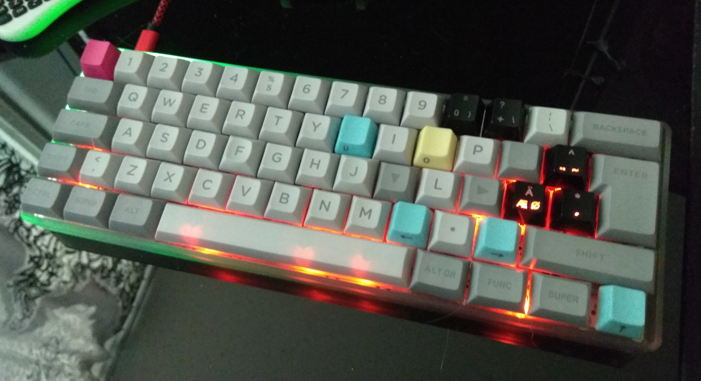

# mjturt keymap for DZ60

- ISO-layout
- HJKL for arrows

#### Build
```
make dz60:mjturt
```

## Layers:
- Default: (DL, 0)
- Function: Function and navigation keys (FL, 1)
- Control: Backlight and media control (CL, 2)

### Default:
```
 ,-----------------------------------------------------------------------------------------.
 | Esc |  1  |  2  |  3  |  4  |  5  |  6  |  7  |  8  |  9  |  0  |  -  |  =  |   Bkspc   |
 |-----------------------------------------------------------------------------------------+
 | Tab    |  Q  |  W  |  E  |  R  |  T  |  Y  |  U  |  I  |  O  |  P  |  Å  |  ^  |        |
 |----------------------------------------------------------------------------------| Entr +
 | Func1    |  A  |  S  |  D  |  F  |  G  |  H  |  J  |  K  |  L  |  Ö  |  Ä  |  '  |      |
 |-----------------------------------------------------------------------------------------+
 | Shift |  <  |  Z  |  X  |  C  |  V  |  B  |  N  |  M  |  ,  |  .  |  -  |     Shift     |
 |-----------------------------------------------------------------------------------------+
 | Ctrl | Super | Alt  |              Space               | Alt gr | Func1 | Super | Func2 |
 `-----------------------------------------------------------------------------------------'
```

### Function:
```
 ,-----------------------------------------------------------------------------------------.
 | GRV |  F1 |  F2 |  F3 |  F4 |  F5 |  F6 |  F7 |  F8 |  F9 |  F10 |  F11 |  F12 |  DEL   |
 |-----------------------------------------------------------------------------------------+
 |        |BTN1 | MUP | BTN2|     | pUp | Home| End | Esc |     |PrnSc| Up |      |        |
 |----------------------------------------------------------------------------------|      +
 |          | MLFT| MDWN| MRGT|     | pDn | Lft | Dwn | Up  | Rht | Lft | Dwn | Rht |      |
 |-----------------------------------------------------------------------------------------+
 |       |     |     |     |     |EVIM |     |     |     |     |     |     |               |
 |-----------------------------------------------------------------------------------------+
 |      |      |       |                                  |        |       |       |       |
 `-----------------------------------------------------------------------------------------'
```

### Control:
```
 ,-----------------------------------------------------------------------------------------.
 | RST |     |     |     |     |     |     |     |     |     |      |      |      |        |
 |-----------------------------------------------------------------------------------------+
 |        |  RV+|  RH+| RS+ |RRain|     |     |     |     |     | Play| vUp|      |        |
 |----------------------------------------------------------------------------------|      +
 |          | RV- | RH- | RS- |     |     |     |     |     |     | Prv | vDn | Nxt |      |
 |-----------------------------------------------------------------------------------------+
 |       |BLON |BLSTP|     |     |     |     |     | MUTE|     |     |     |               |
 |-----------------------------------------------------------------------------------------+
 |      |      |       |             Play                 |        | RGBON | RGBTGL|       |
 `-----------------------------------------------------------------------------------------'
```

## Picture

