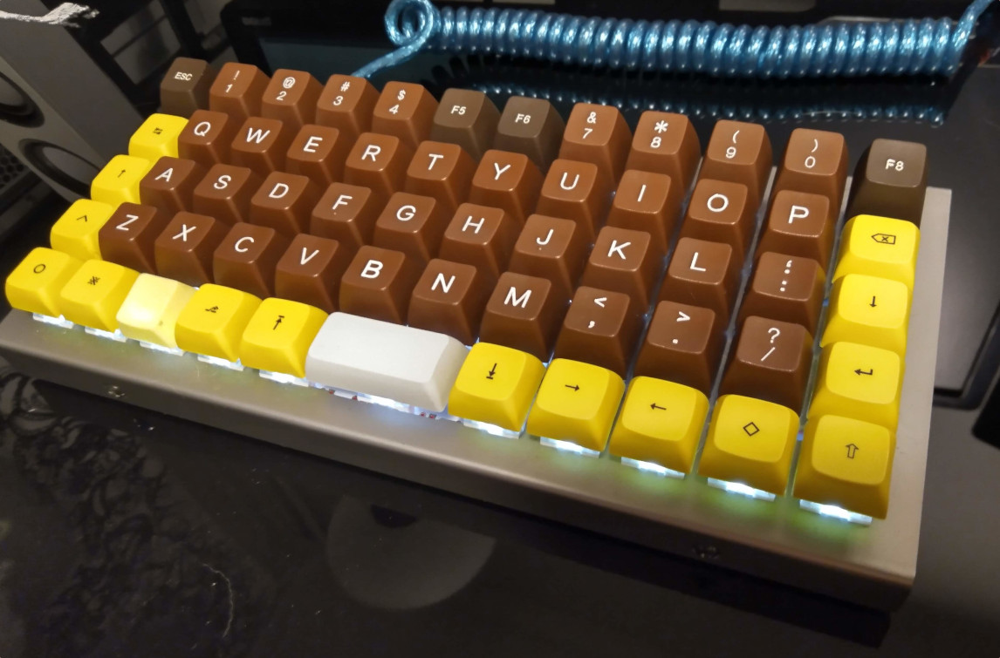

# mjturt keymap for JJ50 ortholinear

Keymap is for Preonic-like ortholinear JJ50 keyboard. It is intended to use with finnish software layout.

- Nordic layout kept in mind
- Designed for generic use and programming
- Vi-like

#### Build & Program
```
make jj50:mjturt:program
```
 
## Layers:
- Default (DEF)
- Raise: Special characters (RAISE)
- Lower: Numbers and more special characters (LOWER)
- Navigation: Navigation (NAV)
- Gaming: Arrow keys (GAM)
- Numpad + mouse: Numpad + mouse keys (NUM)

__Diagrams shows keys in finnish layout__

### Default:
```
 ,-----------------------------------------------------------------------------------.
 |  ´   |   1  |   2  |   3  |   4  |   5  |   6  |   7  |   8  |   9  |   0  |   +  |
 |------+------+------+------+------+------+------+------+------+------+------+------|
 |Tab/M1|   Q  |   W  |   E  |   R  |   T  |   Y  |   U  |   I  |   O  |   P  | Bksp |
 |------+------+------+------+------+------+------+------+------+------+------+------|
 | Esc  |   A  |   S  |   D  |   F  |   G  |   H  |   J  |   K  |   L  |   ö  |  ä   |
 |------+------+------+------+------+------+------+------+------+------+------+------|
 | Shift|   Z  |   X  |   C  |   V  |   B  |   N  |   M  |   ,  |   .  |   -  |Etr/M1|
 |------+------+------+------+------+------+------+------+------+------+------+------|
 | Ctrl | GUI  | M_NUM| GUI  |Raise |    Space    |Lower | RALT | RGUI |  @   |'/RSHT|
 `-----------------------------------------------------------------------------------'
```

### Raise:
```
 ,-----------------------------------------------------------------------------------.
 | F12  |  F1  |  F2  |  F3  |  F4  |  F5  |  F6  |  F7  |  F8  |  F9  |  F10 |  F11 |
 |------+------+------+------+------+------+------+------+------+------+------+------|
 |   ½  |   !  |   "  |   #  |   ¤  |   %  |   &  |   /  |   (  |   )  |   =  | Del  |
 |------+------+------+------+------+------+------+------+------+------+------+------|
 |      |      |      |      |      |      |      |   (  |   )  |   \  |   ^  |  *   |
 |------+------+------+------+------+------+------+------+------+------+------+------|
 |      |      |      |      |      |      |      |  {   |   }  |  +   |  ?   |      |
 |------+------+------+------+------+------+------+------+------+------+------+------|
 |      |      |      |      |      |             |      |      |      |      |      |
 `-----------------------------------------------------------------------------------'
```

### Lower:
```
 ,-----------------------------------------------------------------------------------.
 | F12  |  F1  |  F2  |  F3  |  F4  |  F5  |  F6  |  F7  |  F8  |  F9  |  F10 |  F11 |
 |------+------+------+------+------+------+------+------+------+------+------+------|
 |   §  |   1  |   2  |   3  |   4  |   5  |   6  |   7  |   8  |   9  |   0  | Del  |
 |------+------+------+------+------+------+------+------+------+------+------+------|
 |      |  å   |      |      |      |      |      |   [  |   ]  |      |      |      |
 |------+------+------+------+------+------+------+------+------+------+------+------|
 |      |  |   |      |      |      |      |      |   <  |   >  |      |      |      |
 |------+------+------+------+------+------+------+------+------+------+------+------|
 |      |      |      |      |      |             |      |      |      |      |      |
 `-----------------------------------------------------------------------------------'
```

### Navigation:
```
 ,-----------------------------------------------------------------------------------.
 |      |      |      |      |      |      |      |      |      |      |      |Reset |
 |------+------+------+------+------+------+------+------+------+------+------+------|
 |      |      |      |      |PrnScr| PgUp |      | Home | End  | Esc  | Bspc | Del  |
 |------+------+------+------+------+------+------+------+------+------+------+------|
 |TG_GAM|RGB_TG|RGB_MO|RGB_HI|      | PgDn | Left | Down |  Up  |Right |      |Enter |
 |------+------+------+------+------+------+------+------+------+------+------+------|
 |      |BL_TG |BL_ST |      |      |      |      |      | Mute |      |VolUp |      |
 |------+------+------+------+------+------+------+------+------+------+------+------|
 |      |      |      |      |      |    Pause    |      |      | Prev |VolDn | Next |
 `-----------------------------------------------------------------------------------'
```

### Gaming:
```
 ,-----------------------------------------------------------------------------------.
 |      |      |      |      |      |      |      |      |      |      |      |      |
 |------+------+------+------+------+------+------+------+------+------+------+------|
 |      |      |      |      |      |      |      |      |      |      |      |      |
 |------+------+------+------+------+------+------+------+------+------+------+------|
 |      |      |      |      |      |      |      |      |      |      |      |      |
 |------+------+------+------+------+------+------+------+------+------+------+------|
 |      |      |      |      |      |      |      |      |      |      |  Up  |      |
 |------+------+------+------+------+------+------+------+------+------+------+------|
 |      |      |      |      |      |             |      |      | Left | Down |Right |
 `-----------------------------------------------------------------------------------'
```

### Numpad + mouse:
```
 ,-----------------------------------------------------------------------------------.
 |      |      |      |      |      |      |      |      |      |      |      |      |
 |------+------+------+------+------+------+------+------+------+------+------+------|
 |      |      |      |      |      |      |      |  7   |  8   |  9   |      |WH_UP |
 |------+------+------+------+------+------+------+------+------+------+------+------|
 |      |      |      |      |      |      |      |  4   |  5   |  6   |      |WH_DN |
 |------+------+------+------+------+------+------+------+------+------+------+------|
 |      |      |      |      |      |      |      |  1   |  2   |  3   | MUp  |MBTN2 |
 |------+------+------+------+------+------+------+------+------+------+------+------|
 |      |      |      |      |      |      0      |      |MBTN1 |MLeft |MDown |MRight|
 `-----------------------------------------------------------------------------------'
```

## Picture

